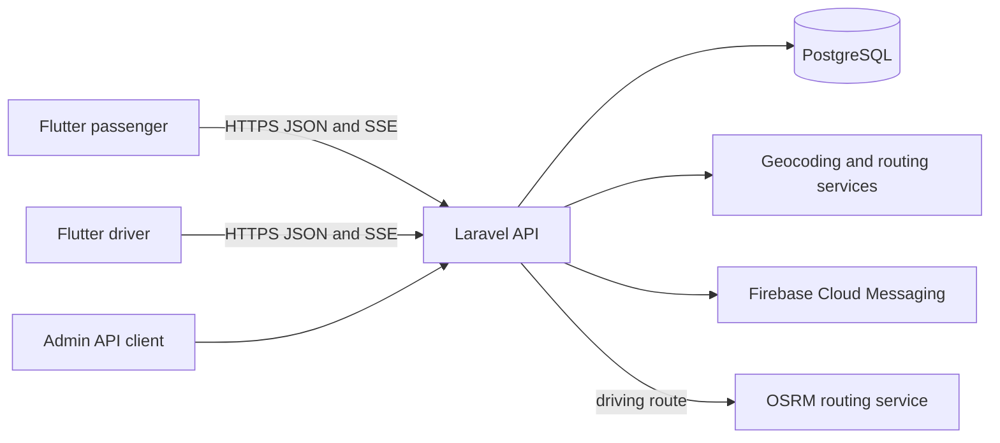

# Good Day Kilo Taxi MVP

A one-city, cash-only taxi booking app for a **Yangon, Myanmar pilot**. Passengers search for pickup and destination locations or select them on a map. The backend calculates driving distance and an approximate fare in Myanmar kyats before a booking is placed.

The example fare is **Ks 2,000 base + Ks 1,000 per routed kilometer** with an **8 km** driver search radius. These are editable demonstration values, not commercial pricing advice. The estimate is `base + ceil(route_meters / 1000 × per_km_rate)`.

## What works

- Passenger and driver email accounts with Laravel Sanctum tokens.
- Signed-in users can update their name and phone number and securely change their password from the mobile account screen.
- Phone numbers are collected during registration. Once a driver accepts, the assigned passenger and driver can call each other from the ride screen.
- Searchable pilot place list for pickup and destination, plus GPS pickup.
- Ten-minute route and cash fare quote in MMK, calculated server-side with OSRM.
- Requests sent to online drivers near pickup whose locations are current.
- First eligible driver to accept wins. Passenger immediately sees the driver name, vehicle plate, and booking status through a live event stream.
- Firebase push notifications alert backgrounded drivers about new requests and passengers about ride status changes.
- After going online, Android keeps a foreground location service running with a persistent notification. The driver app sends location updates about every 10 seconds while online or on an active ride, and the passenger sees the live taxi marker and distance to pickup.
- Driver can start and complete a ride; passenger can cancel before it starts. Unanswered requests expire after two minutes.
- After a completed trip, the passenger can leave a one-to-five-star driver rating with optional feedback.
- Admin API lists bookings and drivers and edits the base fare, per-km rate, and search radius.
- Browser admin dashboard shows ride activity, driver availability, recent bookings, and editable fare settings.
- Newly registered drivers stay pending until an admin approves them; pending or rejected drivers cannot go online or receive bookings.

## Run locally

Requirements: PHP 8.2+, Composer, Flutter 3.44+, Docker (or PostgreSQL 16), and two devices/emulators or one device plus Flutter web.

1. In this folder, start PostgreSQL: `docker compose up -d db`.
2. In `backend`, run `composer install`, copy `.env.example` to `.env`, then run `php artisan key:generate` and `php artisan migrate --seed`.
3. Start the API from `backend`: `PHP_CLI_SERVER_WORKERS=4 php artisan serve --host=0.0.0.0 --port=8000`. Multiple local server workers allow live streams and normal requests at the same time.
4. In `mobile`, run `flutter pub get`, then `flutter run --dart-define=API_BASE_URL=http://10.0.2.2:8000/api` for an Android emulator. For iOS Simulator or Flutter web, use `http://localhost:8000/api`. For a physical phone, use the computer's LAN IP and ensure the phone can reach the API.
5. Register a driver and go online while in Yangon. Register a passenger on the second device, choose two pilot places, review the kyat estimate, book, and accept from the driver app.

## Android demo APK

`Good-Day-Kilo-Taxi-demo.apk` is an internal test build. The opening role choice, English/Myanmar switch, account screens, and local interface are included. Registration, login, fare quotes, live driver offers, and booking status require the Laravel API. The default APK expects that API at `http://10.0.2.2:8000/api`, which is the host computer from an Android emulator.

This APK uses a development signing key and is not intended for Google Play. Before external distribution, deploy the API over HTTPS, set a permanent Android application ID, create a protected release signing key, add privacy and support information, and run device testing.

To create an admin, register an account and run `php artisan taxi:make-admin email@example.com` in `backend`. Admin endpoints require its token. Open [wireframes.html](wireframes.html) in a browser for the interactive screen prototype. It starts with a role choice, then walks through the passenger journey and the driver journey one screen at a time.

The browser operations dashboard is available at `/admin`. Sign in with an account whose role is `admin`; passenger and driver accounts are rejected even when their password is correct.

The prototype passenger home also includes Call Now, Viber Booking, My Rides, Favorites, Live Tracking, and Support walkthroughs inspired by the supplied UI reference. Call Now and Viber Booking are visual demos: they do not place calls or send messages. Add verified business contact details before enabling either action in a live app.

## Language

Tap the language icon in the mobile app, or the **English / မြန်မာ** switch in the prototype. The choice is saved on the device. Passenger and driver screens, buttons, fare labels, and the pilot place list appear in the selected language. The API continues to use stable English place IDs and status codes; some server validation errors may still appear in English.

## How map search works

`GET /api/places` returns common pilot locations from [`backend/config/taxi_places.php`](backend/config/taxi_places.php). The mobile picker also searches addresses through the Laravel geocoding proxy and lets the passenger position a pin inside the Yangon service area. Route previews use OpenStreetMap tiles, while the backend requests road distance and route geometry from OSRM.

The passenger may use the device's GPS coordinates as pickup. The backend checks that both points are within the configured city rectangle. For a future countrywide rollout, replace the one-city boundary and curated list with a production geocoding and routing setup. The default scope is Yangon because version 1 was specified as one city.

## Architecture



`GET /api/stream` sends a snapshot when a booking, offer, or driver location changes and a keepalive otherwise. Connections last about 50 seconds, then Flutter reconnects. For local testing, the stream checks the database every two seconds. Production traffic should move this polling stream to a queue-backed real-time service when usage grows.

## Database schema

| Table | Main fields | Purpose |
| --- | --- | --- |
| `users` | name, email, phone, password, role | Passenger, driver, or admin account |
| `driver_profiles` | user_id, plate, approval_status, availability, latitude, longitude, location_updated_at | Driver approval, vehicle, and current availability |
| `fare_settings` | city, currency, base_fare_minor, per_km_minor, search_radius_km | Pilot fare configuration |
| `quotes` | passenger_id, pickup/destination labels and coordinates, distance_meters, fare_minor, expires_at | Server-calculated route and estimate |
| `bookings` | passenger_id, driver_id, quote_id, status, timestamps | Ride lifecycle |
| `booking_offers` | booking_id, driver_id, status | Nearby driver invitations |
| `ride_ratings` | booking_id, passenger_id, driver_id, rating, comment | One passenger review per completed ride |
| `device_tokens` | user_id, token, platform, last_seen_at | Firebase notification destinations |
| `personal_access_tokens` | Sanctum token data | Mobile API authentication |

Booking status: `searching → accepted → started → completed`; `searching` can become `unfulfilled`, and the passenger may cancel while `searching` or `accepted`. PostgreSQL row locks protect acceptance so only one driver wins. `fare_minor` stores a whole-kyat amount for this MMK pilot.

## API summary

All paths start with `/api`. Authenticated paths use `Authorization: Bearer <token>`.

| Method | Path | Role | Result |
| --- | --- | --- | --- |
| POST | `/register` | Public | Create passenger or driver account |
| POST | `/login` | Public | Return token and account |
| GET | `/settings` | Public | City and fare settings |
| GET | `/places` | Public | Named pilot pickup/destination locations |
| GET | `/me` | Any signed-in | Account profile |
| PUT | `/me` | Any signed-in | Update name, phone, and optional password |
| POST | `/logout` | Any signed-in | Revoke current token |
| POST/DELETE | `/device-tokens` | Any signed-in | Register or remove a phone notification token |
| POST | `/quotes` | Passenger | Road distance, approximate fare, quote ID |
| POST | `/bookings` | Passenger | Book with quote ID, offer to nearby drivers |
| GET | `/bookings/active` | Passenger/driver | Current active ride |
| GET | `/bookings/{id}` | Passenger/assigned driver/admin | Booking detail |
| POST | `/bookings/{id}/cancel` | Passenger | Cancel before start |
| GET | `/driver/status` | Driver | Availability and location |
| PUT | `/driver/location` | Driver | Update location and online status |
| GET | `/driver/offers` | Driver | Current nearby requests |
| POST | `/bookings/{id}/accept` | Offered driver | Claim request |
| POST | `/bookings/{id}/start` | Assigned driver | Begin ride |
| POST | `/bookings/{id}/complete` | Assigned driver | Complete ride |
| POST | `/bookings/{id}/rating` | Passenger | Rate a completed ride |
| GET | `/stream` | Any signed-in | Live SSE snapshots |
| GET | `/admin/bookings` | Admin | Paginated bookings |
| GET | `/admin/drivers` | Admin | Driver overview |
| PUT | `/admin/fare` | Admin | Update fare/radius |

Example quote body with listed places:

```json
{"pickup":{"place_id":"sule"},"destination":{"place_id":"shwedagon"}}
```

For GPS pickup, send `{"pickup":{"latitude":16.7745,"longitude":96.1582,"label":"My current location"},"destination":{"place_id":"shwedagon"}}`. `POST /bookings` accepts `{"quote_id":"<id from quote>"}`. Errors use Laravel JSON responses with HTTP 401, 403, 409, or 422.

## Configuration and production notes

- `backend/.env.example` sets PostgreSQL, routing URL, and Yangon bounds. `SERVICE_CITY` selects the active fare row. Edit the city and [`taxi_places.php`](backend/config/taxi_places.php) together when piloting another city.
- The public OSRM demo URL is for development. Use a reliable routing service before launch; its [route API](https://project-osrm.org/docs/v5.24.0/api/) returns driving distance in meters.
- Use HTTPS in release builds, verify driver accounts and pickup points, require Android drivers to grant “Allow all the time” location access, secure token storage, rate limiting, and operational monitoring before real riders use the app. Review Android foreground-service and Google Play location policies before publishing.
- Admin is an API in this MVP; connect a Laravel dashboard when staff need a browser interface.

## Verification

`backend`: `php artisan test --compact` covers listed places, kyat fares, nearby offers, first-driver acceptance, ride lifecycle, validation, and admin authorization. `mobile`: `flutter analyze` and `flutter test` validate the map-free UI, role selection, saved language choice, and Myanmar place search.
